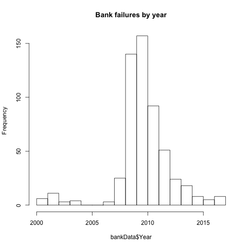

Historical Bank Failures
========================================================
author: Vishal Agarwal
date: July 6, 2018
autosize: true

Bank Failures - Introduction
========================================================

US Government has published data on Bank failures on their website here:
http://www.fdic.gov/bank/individual/failed/banklist.csv

- Provides Bank Name and City, State 
- Includes date of failure

Summary of bank failures
========================================================

```r
  bankData <- read.csv("banklist.csv")
  bankData$Closing.Date <- as.Date(bankData$Closing.Date, "%d-%b-%y")
  bankData$Year <- as.numeric(format(bankData$Closing.Date, "%Y"))
  bankData$Cities <- paste(as.character(bankData$City), as.character(bankData$ST), sep = ", ")
  summary(bankData[, c("Cities", "Year")])
```

```
    Cities               Year     
 Length:555         Min.   :2000  
 Class :character   1st Qu.:2009  
 Mode  :character   Median :2010  
                    Mean   :2010  
                    3rd Qu.:2011  
                    Max.   :2017  
```


Histogram of failed data
========================================================


```r
  hist(bankData$Year, breaks = 1999 + seq(18), main = "Bank failures by year")
```



Motivation
========================================================

- Helps us understand the impact of financial crisis
- Data helps to see recurring pattern
